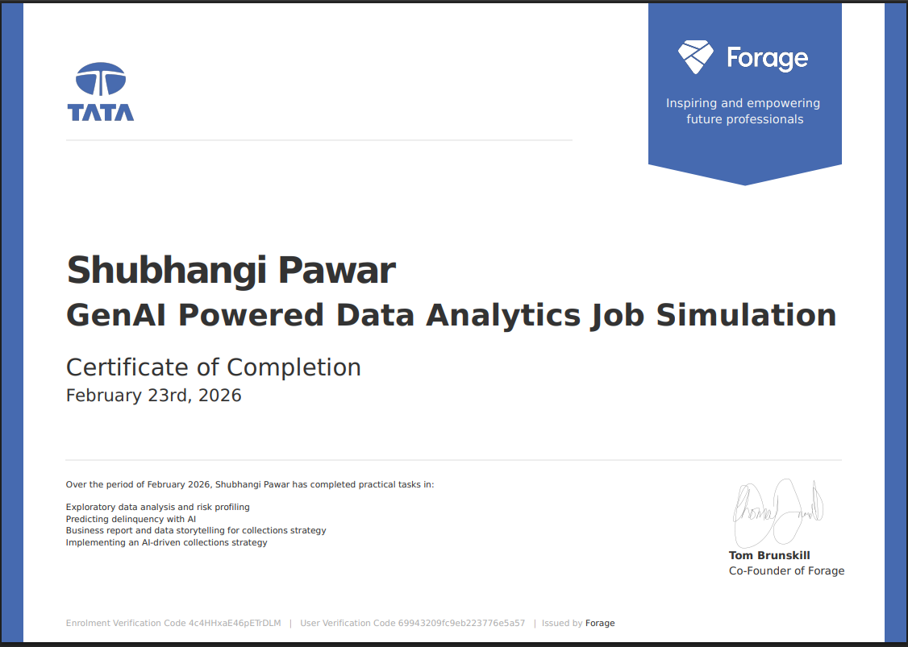

# Tata x Forage – GenAI Powered Data Analytics (Delinquency Risk & Collections Strategy)

This repository contains my work for the **Tata iQ x Forage “GenAI Powered Data Analytics” Job Simulation** (Certificate of Completion: **Feb 23, 2026**).

The simulation focuses on **financial services analytics**: using structured analysis + GenAI support to understand **credit card delinquency risk**, propose an **interpretable predictive modeling approach**, and translate insights into **stakeholder-ready recommendations** with **Responsible AI guardrails**.

---

## 🔎 Problem Statement (Business Context)

Geldium Finance observed an increase in credit card delinquency and wants a more **data-driven** approach to:

- **Identify customers at high risk** of delinquency *(Delinquent_Account: 0/1)*
- **Prioritize collections outreach** (who to contact first)
- Recommend **interventions** that are measurable and practical
- Ensure the approach is **fair, explainable, and compliant**

---

## 📦 Dataset Overview (Provided in Simulation)

- **Rows:** 500 customers  
- **Columns:** 19  
- **Target variable:** `Delinquent_Account` *(0 = No, 1 = Yes)*
- **Target distribution:** 420 non-delinquent (84%), 80 delinquent (16%)
- **Data types:** 9 numerical + 10 categorical (including payment history Month_1–Month_6)

### Key Columns (from Dataset Description Guide)
**Numerical**
- `Age`, `Income`, `Credit_Score`, `Credit_Utilization`, `Missed_Payments`
- `Loan_Balance`, `Debt_to_Income_Ratio`, `Account_Tenure`

**Categorical**
- `Employment_Status`, `Credit_Card_Type`, `Location`
- `Month_1` to `Month_6` (payment history: On-time / Late / Missed)

> ⚠️ Note: The dataset is **not included** in this repository (simulation-provided data).

---

## ✅ Task 1 — EDA & Risk Profiling (Summary)

### Data Quality Checks
- Verified dataset structure (rows/columns), data types, and target distribution
- Checked missing values and inconsistencies

### Missing Values Found
- `Income`: **39 missing** (~7.8%)
- `Credit_Score`: **2 missing** (~0.4%)

### Missing Data Treatment (Chosen Approach)
- `Income`: **Median imputation**, preferably *median within Employment_Status* (fallback: overall median)
- `Credit_Score`: **Median imputation** (only 2 missing; low risk)

**Reasoning:** Missingness is limited and concentrated in few fields, so median imputation preserves dataset size and reduces bias from dropping rows.

---

## 🧠 Task 2 — Predictive Model Plan (Conceptual, GenAI-Assisted)

### Chosen Model Type
**Logistic Regression (Primary)**  
- Interpretable and suitable for binary outcomes  
- Outputs a **probability score**, easy to convert into risk tiers (High/Medium/Low)

**Decision Tree (Secondary option)**  
- Simple “rule-style” explanations for quick stakeholder understanding

### High-Level Pipeline (Step-by-Step)
1. **Load data** + validate schema  
2. **Handle missing values** (Income/Credit_Score via medians)  
3. **Preprocess**
   - One-hot encode categorical variables  
   - Scale numeric features (if required for LR)
4. **Feature engineering (optional but useful)**
   - Create a **Payment Risk Score** from Month_1–Month_6  
     *(e.g., count of Missed + count of Late)*
5. **Train/Test split**
   - Use **stratified split** (preserve 84/16 class ratio)
6. **Model output**
   - Probability → Risk tiers (High/Med/Low) + recommended next action

### Top 5 Features to Focus On (Conceptual)
- Payment history (`Month_1`–`Month_6`) / Payment Risk Score  
- `Missed_Payments`  
- `Debt_to_Income_Ratio`  
- `Credit_Utilization`  
- `Credit_Score`

---

## 📊 Task 3 — Business Summary Report (Collections Strategy)

### Top 3 Risk Factors (Simple Communication)
1. **Recent payment behavior** (Month_1–Month_6 / Missed_Payments)  
2. **Affordability stress** (Debt-to-Income + Credit Utilization)  
3. **Credit profile strength** (Credit Score + Income)

### SMART Recommendation (Example)
**Pilot a 6-week SMS + call outreach program** for customers who have:  
- **2+ “Missed”** payments in recent months **AND**  
- **High DTI or high credit utilization**

**Success measures**
- Reduce 30+ day delinquency by ~10% for pilot group vs baseline/control  
- Track response rate, payment completion rate, delinquency rate after outreach

---

## 🛡️ Responsible AI Guardrails (Bias / Explainability / Compliance)

### Key Risks
- **Proxy bias:** Income and Location can act as proxies for sensitive attributes  
- **Class imbalance:** minority delinquent class (16%) risks uneven error impact

### Mitigations
- **Human-in-the-loop:** model supports prioritization, not automatic punitive decisions  
- **Fairness checks:** compare precision/recall across segments (Employment_Status, Location, age bands)  
- **Explainability:** use interpretable models + “top reasons” summary for decisions  
- **Auditability:** logging of decisions, thresholds, and changes  
- **Privacy:** least-privilege access to data; avoid sharing sensitive details in outputs

---

## 📄 Deliverables (Included in Repo)

- [EDA Summary Report (Task 1)](./Shubhangi_Pawar_Geldium_EDA_Report1.pdf)
- [Predictive Model Plan (Task 2)](./Shubhangi_Pawar_Geldium_Predictive_Model_Plan.pdf)
- [Business Summary Report (Task 3)](./Shubhangi_Pawar_report.pdf) 
- [Final Slide Deck (Task 4)](./Geldium_AI_Collections_System_Shubhangi.pptx)
- **Certificate**
- 

---

## 🤖 GenAI Usage (How I used it)

GenAI was used as a **support tool** to:
- Summarize patterns and anomalies discovered during EDA  
- Structure the predictive modeling plan and evaluation strategy  
- Improve clarity of stakeholder communication and recommendations  

✅ Final decisions (data handling, modeling choice, evaluation approach) were validated using dataset context and standard analytics practices.

---

## 🔗 Links

- **LinkedIn post:** <shubhangipawar18>

---

## 👤 Author

**Shubhangi Pawar**

- 📧 Email: ishubhangipawar@gmail.com
- 💼 LinkedIn: [linkedin.com/in/shubhangipawar18](https://www.linkedin.com/in/shubhangipawar18)
- 🌐 GitHub: [github.com/shubhangipawar18](https://github.com/shubhangipawar18)

